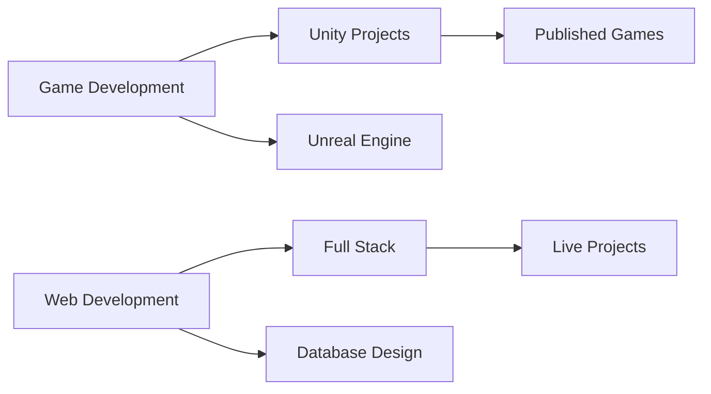

<div align="center">

# 👋 Merhaba, Ben Halilibrahim Karaoğlan


<picture>
  <source media="(prefers-color-scheme: dark)" srcset="https://raw.githubusercontent.com/KaraoglanHalilibrahim/KaraoglanHalilibrahim/output/github-contribution-grid-snake-dark.svg">
  <source media="(prefers-color-scheme: light)" srcset="https://raw.githubusercontent.com/KaraoglanHalilibrahim/KaraoglanHalilibrahim/output/github-contribution-grid-snake.svg">
  
</picture>

<br><br>


</div>

---

## 🚀 About Me

```typescript
const halilibrahim = {
    location: "Adıyaman, Turkey 🇹🇷",
    role: "Computer Engineer & Game Developer",
    currentFocus: "Building immersive gaming experiences",
    learning: ["Advanced Unity Techniques", "Game Optimization", "Unreal Engine"],
    hobbies: ["🎮 Game Development", "✍️ Technical Writing", "🎨 UI/UX Design"],
    funFact: "I turn coffee into code and code into games! ☕"
};
```

<div align="center">

## 🎮 Current Project

[](https://www.linkedin.com/posts/halilibrahimkaraoglan_unity-longdrive-thelongdrive-activity-7177426934975315968-nku-)

*Building an exciting new game with Unity - Stay tuned for updates!*

</div>

---

## 🛠️ Tech Stack & Tools

<div align="center">

### Game Development


### Web Technologies


### Database & Backend


</div>

---

## 📊 GitHub Statistics

<div align="center">
  
  
</div>

<div align="center">
  
</div>

<div align="center">
  
</div>

---

## 📝 Latest Blog Posts

<div align="center">

[](https://medium.com/@HalilibrahimKaraoglan)

</div>

<!-- BLOG-POST-LIST:START -->
<!-- BLOG-POST-LIST:END -->

*📚 Check out my technical articles on [Medium](https://medium.com/@HalilibrahimKaraoglan)*

---

## 🌐 Connect With Me

<div align="center">

[](https://linkedin.com/in/halilibrahimkaraoglan)
[](https://twitter.com/hllibrhmkrogln)
[](https://instagram.com/ka_ra_og_lan)
[](https://www.youtube.com/c/halilibrahimkaraoglan8994)
[](https://fb.com/KaraoglanHalilibrahim)
[](https://medium.com/@halilibrahimkaraoglan)

</div>

---

## 💼 Work Experience & Portfolio

<div align="center">



📂 **Portfolio:** [LinkedIn Profile](https://www.linkedin.com/in/halilibrahim-karao%C4%9Flan-398234214/)

📧 **Email:** halilibrahimkaraoglan92@gmail.com

</div>

---

## 🎯 2024 Goals

- [x] Start new game development project
- [ ] Launch first commercial game
- [ ] Contribute to open source game engines
- [ ] Write 50+ technical articles
- [ ] Master Unreal Engine 5
- [ ] Build game development community

---

<div align="center">

### 💭 Random Dev Quote


### 😄 Random Dev Meme


---

### 🎵 Now Playing on Spotify

[](https://open.spotify.com)

---


**⭐️ From [KaraoglanHalilibrahim](https://github.com/KaraoglanHalilibrahim)**

</div>
